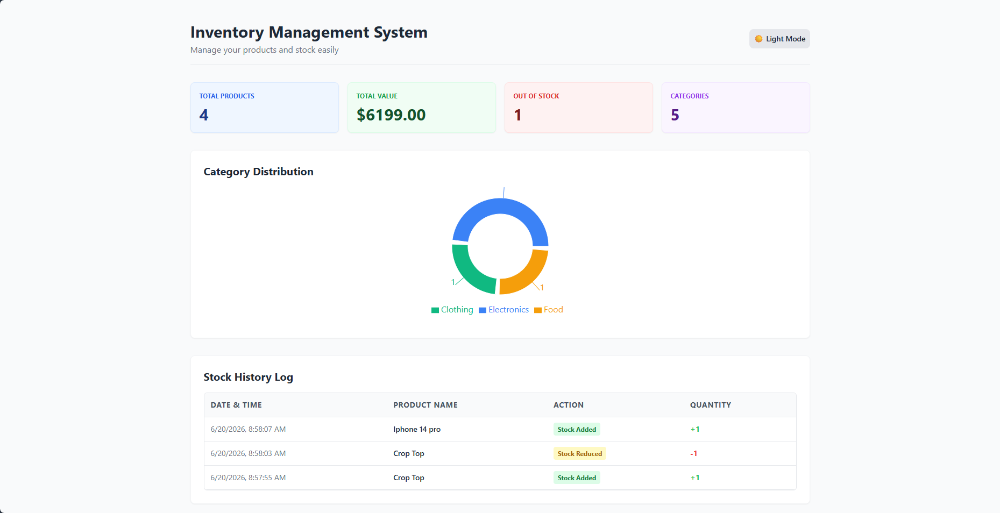
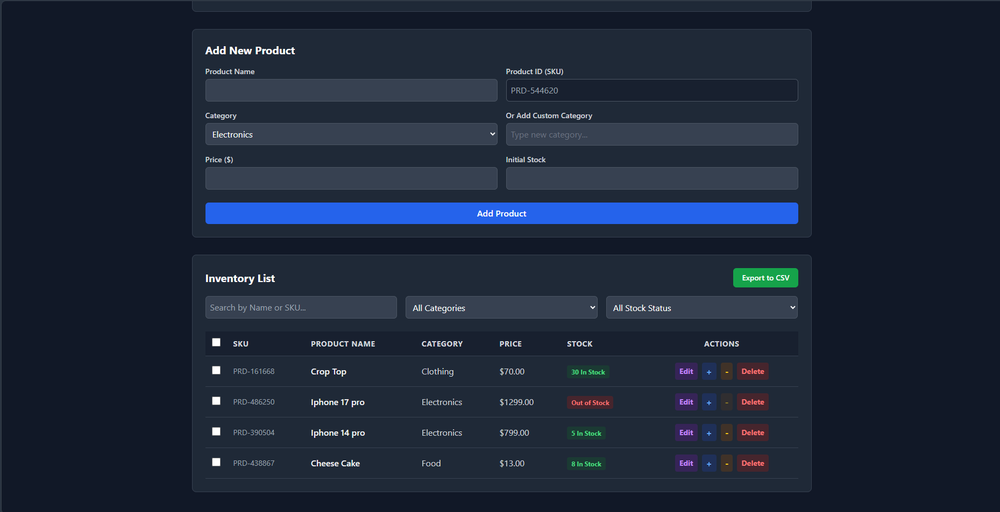

# Inventory Management System

🔗 **Live Demo:** https://smart-inventory-ui.netlify.app/

A simple, frontend-only Inventory Management System built with React and Tailwind CSS. This application allows users to manage products, track stock levels, and view inventory statistics, with all data persisting in the browser's `localStorage`.

## 🚀 Core Features

* **Dashboard Stats:** Quick overview of total products, total inventory value, out-of-stock items, and categories.
* **Product Management:** Add, edit, delete, and view products.
* **Form Validation:** Integrated Formik and Yup for robust form validation (e.g., required fields, positive prices, duplicate product name checking).
* **Stock Management:** Increase or decrease stock levels safely (prevents negative stock).
* **Search & Filtering:** Search by Product Name/SKU, and filter by Category or Stock Status.
* **Professional UI/UX:** Clean, modern layout featuring custom toast notifications and backdrop-blur modal confirmations.
* **Data Persistence:** Uses Context API + `localStorage` to save data without a backend.

## ✨ Bonus Features Implemented

* **Auto-generated SKU:** Automatically generates unique Product IDs (e.g., PRD-123456) for new items.
* **Stock History Log:** Records every stock change with a timestamp, action type, and quantity.
* **Export to CSV:** Allows downloading the full product list as a `.csv` file.
* **Dark Mode:** Fully responsive dark/light theme toggle, saved persistently in `localStorage`.
* **Analytics Chart:** Visualizes category distribution using a dynamic pie chart (`recharts`).
* **Bulk Actions:** Select multiple products using checkboxes to delete or restock them simultaneously.

## 🛠️ Tech Stack

* React.js (Vite)
* Tailwind CSS v3
* Formik + Yup (Validation)
* Recharts (Analytics)
* React Hot Toast (Notifications)
* Context API + LocalStorage (State Management)
* UUID (Unique IDs)

## 🏃‍♂️ How to Run Locally

1. Clone the repository:
   ```bash
   git clone [https://github.com/nethmith/inventory-system.git](https://github.com/nethmith/inventory-system.git)

2. Navigate to the project directory:
    ```bash
    cd inventory-system
    
3. Install dependencies:
    ```bash
    npm install

4. Start the development server:
    ```bash
    npm run dev
    
5. Open your browser and visit http://localhost:5173

## 📷 Screenshots

### Light Mode


### Dark Mode

